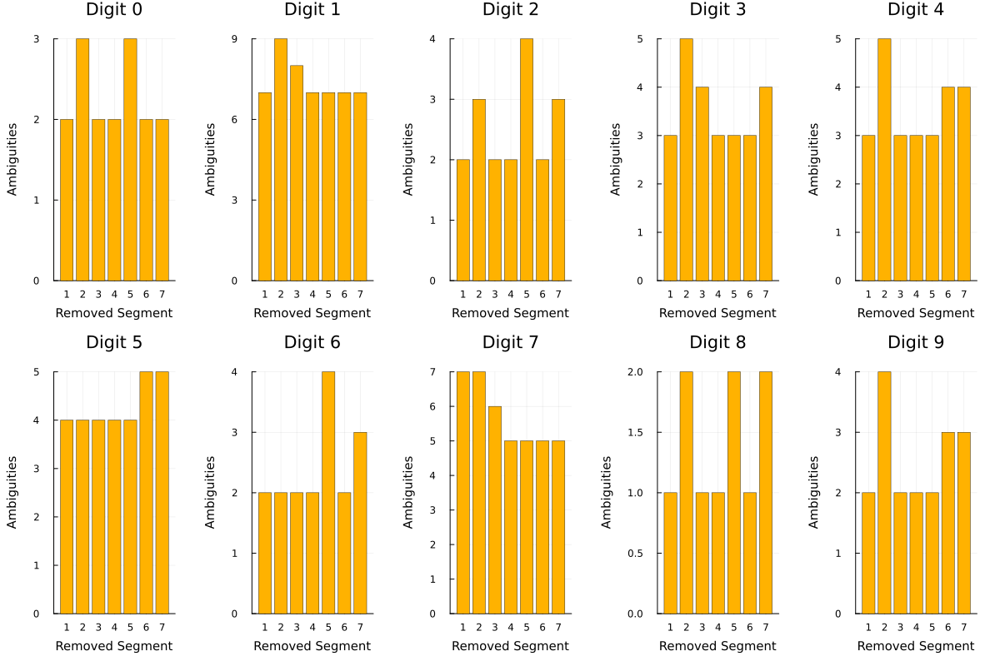

# The Role of Faulty Segments in Digital Display Ambiguities

On a cold winter day, my friend was waiting for his meal to be ready in a microwave oven in his office. While looking at the oven's counter, two main questions came to his mind:

1. Which segment plays the most important role in displaying characters or numbers in standard English text?
2. Which faulty or broken segment causes the most ambiguity in perceiving the displayed character or number?

He shared his thoughts with me, and I decided to simulate the second question. The first one, while interesting, is relatively easy to answer. You simply need to compare the frequency of characters and numbers (although numbers do not exhibit a pattern of repetition in text, unlike characters) with the "on" segments of those characters and numbers.

The second question, however, is very intriguing and bears similarities to concepts like fault tolerance and Hamming distance. I decided to simulate this case. My first solution to address this question is as follows:

In each digit, we have labeled segments. For each digit, we deliberately turn off one segment, and then we activate the segments one by one to see which digit the displayed number matches. This approach is similar to analyzing Hamming distance.The Role of Faulty Segments in Digital Display Ambiguities

For this purpose, instead of the conventional naming of the segments using letters (a through g), we represent them with `1` and `0`, where `1` indicates an active segment and `0` an inactive segment. We then create a superset of cases where one segment is deliberately turned off and examine all the possibilities. In each scenario, we ask: Which other number matches this subset of segments?

If turning off a segment results in a higher number of matches, this indicates that the segment plays a significant role in displaying that number. For example, consider the segments of digit `0` represented as an array of 1s and 0s:

`Digit 0: [1, 1, 1, 1, 1, 1, 0]`

In this represThe Role of Faulty Segments in Digital Display Ambiguitiesentation, the segments a to f are all active, while segment g is inactive. Now, we turn off the first segment, resulting in the array `[0, 1, 1, 1, 1, 1, 0]`.

When an observer sees this digit, they might think the first segment is broken and attempt to guess the digit. Similarly, they might suspect the last segment or both are faulty.

If the first segment is broken, they might correctly guess that the displayed digit is `0`. If they guess the last segment is faulty, the array `[0, 1, 1, 1, 1, 1, 1]` matches no other digit, so there is no ambiguity. However, since the observer doesn’t know which segment is faulty (a or g), they might also assume that both segments are faulty. In their imagination, they turn on both segments simultaneously, resulting in a guess of digit `8`.

This means that by removing segment `a` of digit `0`, we create two ambiguities. We repeat this process for all segments of each digit to determine how many ambiguities arise for different faulty segments.
The digits in a 7-segment displays is as follows:

The result of the simulation for each digit is as follows:

As you can see, when displaying digits using seven-segment displays, for most digits, segments `b` and `e` being inactive causes the most ambiguities. In a sense, we can conclude that these two segments play an important role in preventing ambiguities, and therefore, they are significant.

Now, the funny thing is that segment `b` of my friend's microwave oven is inactive.

### Some Notes and Suggestions for future Work:

1. This approach assumes that ambiguities are determined solely by matching subsets, which might oversimplify how we preceive digit ambiguity,

2. It doesn't account for probabilistic factors like the context of numbers (e.g. typical patters in real-world numeric data such as dates, prices, or times)

Alternative approach for solving this problem could be **Contextual Analysis**. Here we can use contextual probability in our analysis. For example in series of digits, like `20X4`, we could weigh guesses toward plausible numbers like 2024 rather than 2074. 